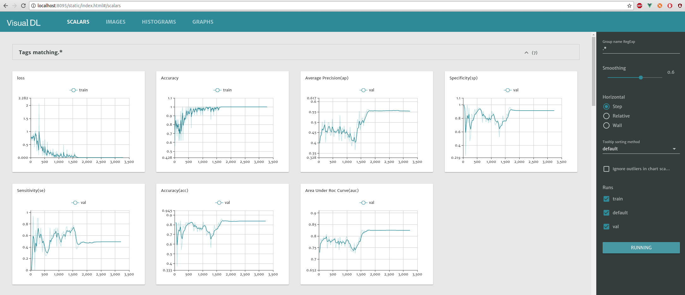
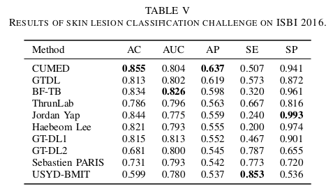

# Skin Lesion Classification with AlexNet

## Brief Description

This repo use AlexNet for skin lesion image classification, serves as a baseline model. The images are from [`ISBI2016_ISIC_Part3`](https://challenge.kitware.com/#challenge/n/ISIC_2016%3A_Skin_Lesioon_Analysis_Towards_Malanoma_Detection), an image classification contest, to distinguish benign and malignant images.

## Image Details

PNG format images. 900 for train and validation. 379 for test.

In my experiments, 70% of 900 (i.e. 630) are randomly chosen for training, the remaining 30% (270) for validation. And the 370 for final test.

## Steps for practise

### 0. Pretrained model

Put pretrained AlexNet model to: `data/imagenet_models/alex.caffemodel` (download it from [here](http://dl.caffe.berkeleyvision.org/bvlc_alexnet.caffemodel))

### 1. Dataset

Download dataset and extract them to `data/isic2016/images/*.jpg`.
Also, prepare `train.txt`, `val.txt` and `test.txt` under `data/isic2016/splits/` folder.

I use python interface to create lmdb database files:
```bash
# remember to modify folder path in this file first!
python tools/create_lmdb.py
```
Note that the default transformation is: (1) resize image to 256 x 256  (2) histogram equalization in applied on center region of resize image. Then you will see `data/isic2016/*_lmdb` folders.


Also, make a mean file:
```bash
bash tools/make_binaryproto.sh
```

### 2. Dependencies

0. [OpenCV](https://opencv.org/)'s Python interface

1. [Caffe](https://github.com/BVLC/caffe) as deep learning framework. Compile Caffe with its Python interface.

2. [VisualDL](https://github.com/paddlepaddle/visualdl) for metrics scalars(such as AP, Accuracy, etc) visualization during training.

3. [sklearn](http://scikit-learn.org/stable/), a python package, here for metrics calculation.

4. [Weighted Softmax Cross Entropy Loss](https://github.com/zchrissirhcz/Weighted_Softmax_Loss)

### 3. Training and Evaluation

The folder `models/{dataset}/{network}/{lab_scheme}` serves as a specific folder to contain prototxt files(`train.pt`, `test.pt`, `solver.pt`)

**Begin training**

```bash
./experiments/scripts/solve_isic.sh isic2016 alex lab5
```
This script will do training with validation after each epoch.

**Visualization**
```bash
visualDL --logdir ./experiments/vdl_logs/isic2016_alex_lab5 --port 8095
```
Now visit http://localhost:8093 to see realtime plot of received scalars (ACC, AUC, AP, SE, SP, loss, etc)

e.g.


**Evaluation**
To evaluate on test dataset, please prepare the trained model, either train it yourself, or download my trained model via [BaiduDisk](https://pan.baidu.com/s/11_Mo3sdfUwIcoX6WdCPRaw).

Evaluate:
```bash
# remember to modify caffemodel file path before using your own model.
python tools/cls_infer_isic.py 
```

### 4. Result

With AlexNet's lab5 (`models/isic2016/alex/lab5`), I use these:

```
resize: 256 x 256
histogram equalization on 50~205 region of resize image
randomly mirror during training
weighted loss weight(2.3 on malignant, 1.0 on begine)
learing rate step: 2000
batch size: train(21), val(54)
base learing rate: 0.001
optimization method: SGD, momentum=0.9 wecay=0.0005
number of iteration: 2000 (~70 training epochs)
```

Metrics that I obtain:
```
ACC=0.834, AUC=0.834, AP=0.586, SE=0.500, SP=0.910
```

And the ranklist during that contest(from [here](http://appsrv.cse.cuhk.edu.hk/~lqyu/skin/)) is:




As the contest mainly rank by AP, this repo provides a competative baseline with 0.586 AP, can rank top4.


